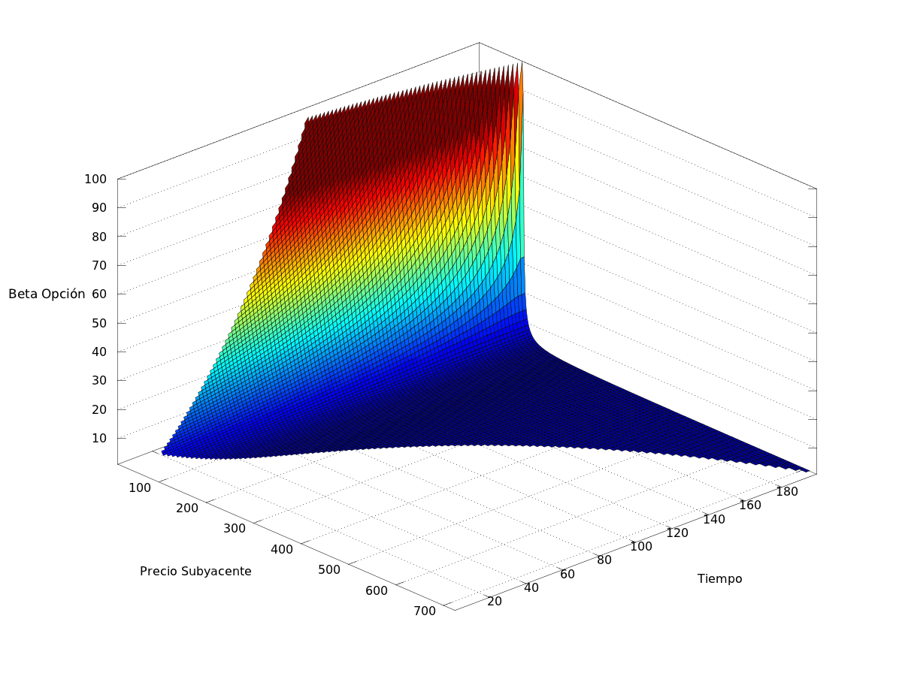

# Utilización del CAPM para la Valuación de Opciones

Trabajo de Investigación Final en Finanzas

**Tutor: Dr. Marcelo Perillo**
Departamento de Economía y Finanzas
Universidad Argentina de la Empresa

**Autor: Diego Jancic**

Fecha Publicación: 9 de febrero de 2012

### Abstract
This essay presents the development of the capital asset pricing model (CAPM) as a method for pricing stock options. It begins with a review of the traditional method of the valuation of assets under market equilibrium. Then the main methods for pricing options are presented, which are the Black-Merton-Scholes and the binomial tree. Finally the mathematical equivalency of these models is verified and then the results are analyzed by using a computer simulation. The ultimate goal is to show the valuation capacity of the CAPM and its correlation with the traditional methods for pricing options.

### Resumen
En el presente trabajo se desarrolla al modelo de valuación de activos de capital (CAPM) como método para la valuación de opciones. Primero se hace un repaso del método clasico de valuación de activos bajo la situación de equilibrio de mercado. Luego se presentan los principales métodos de valuación de opciones, siendo estos el modelo de Black-Merton-Scholes y el de arboles binomiales. Por último se verifica la equivalencia matemática de dichos modelos y se analiza el comportamiento de estos con la utilización de una simulación. El objetivo final es mostrar la capacidad de valuación del mencionado Capital Asset Pricing Model, y su correlato con los métodos tradicionales de valuación de opciones.

# Importante:

El Dr. Perillo, la UADE o el Lic. Jancic no se hacen responsables por el uso que se le pueda dar a la publicación. El contenido publicado aquí fue utilizado como trabajo final e integrador del autor y la publicación en el presente medio es exclusivamente con fines informativo y de archivo.

# Links de Interés

[Texto Completo del Trabajo](Latex/TIF.pdf)

